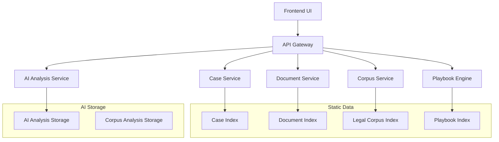
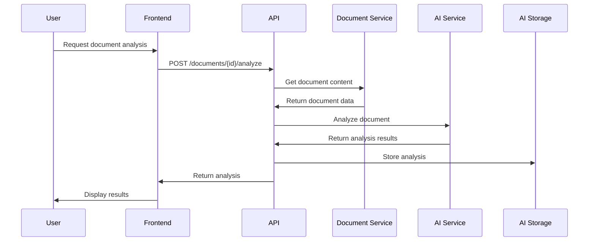
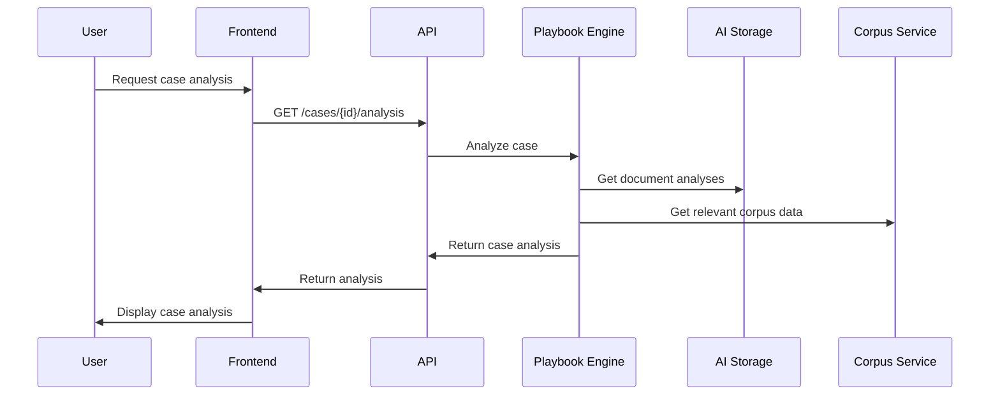

# System Architecture Overview

## High-Level Architecture

The Legal AI System follows a capability-based architecture with clear separation between data management, AI analysis, and user interface components.



## Core Components

### Frontend Layer
- **React Application**: Modern SPA with TypeScript
- **Material-UI Components**: Consistent design system
- **State Management**: React hooks and context
- **Routing**: React Router for navigation

### API Layer
- **FastAPI Framework**: Python-based REST API
- **Automatic Documentation**: OpenAPI/Swagger integration
- **CORS Support**: Cross-origin resource sharing
- **Error Handling**: Standardized error responses

### Service Layer
- **Case Service**: Manages case data and metadata
- **Document Service**: Handles document operations
- **AI Analysis Service**: Performs document analysis
- **Corpus Service**: Manages legal reference materials
- **Playbook Engine**: Handles case analysis logic

### Data Layer
- **Static Indexes**: JSON-based data storage
- **AI Analysis Storage**: Persistent analysis results
- **File System**: Document content storage

## Data Flow Architecture

### Document Analysis Flow


### Case Analysis Flow


## Technology Stack

### Backend
- **Python 3.10+**: Core language
- **FastAPI**: Web framework
- **Pydantic**: Data validation
- **Uvicorn**: ASGI server
- **Pytest**: Testing framework

### Frontend
- **React 18**: UI framework
- **TypeScript**: Type safety
- **Material-UI v5**: Component library
- **React Router**: Navigation
- **Axios**: HTTP client

### Development Tools
- **Git**: Version control
- **ESLint/Prettier**: Code formatting
- **Black**: Python code formatting
- **Playwright**: E2E testing

## Deployment Architecture

### Development Environment
```
Frontend (localhost:8080) ←→ Backend (localhost:8000)
                              ↓
                         Static Data Files
                              ↓
                         AI Analysis Storage
```

### Production Environment
```
Load Balancer
    ↓
Frontend (Static Files) ←→ Backend API (Container)
                              ↓
                         Persistent Storage
                              ↓
                         AI Analysis Database
```

## Security Considerations

### Data Security
- Static data files are read-only
- AI analysis results are stored securely
- No sensitive data in demo environment

### API Security
- CORS configuration for frontend access
- Input validation on all endpoints
- Error handling without data exposure

### Frontend Security
- XSS protection through React
- Input sanitization
- Secure HTTP headers

## Performance Considerations

### Backend Performance
- Efficient JSON parsing for static data
- Caching of frequently accessed data
- Async operations for AI analysis

### Frontend Performance
- Component lazy loading
- Efficient state management
- Optimized bundle sizes

### Data Access Patterns
- Index-based lookups for fast access
- Minimal data transfer between services
- Efficient document content loading

## Scalability Design

### Horizontal Scaling
- Stateless API design
- Shared data storage
- Load balancer ready

### Vertical Scaling
- Efficient memory usage
- CPU optimization for AI operations
- Storage optimization

## Monitoring and Logging

### Application Monitoring
- API endpoint performance
- Error rate tracking
- User interaction analytics

### System Monitoring
- Resource utilization
- Storage capacity
- Response times

### Logging Strategy
- Structured logging format
- Error tracking and alerting
- Audit trail for data access